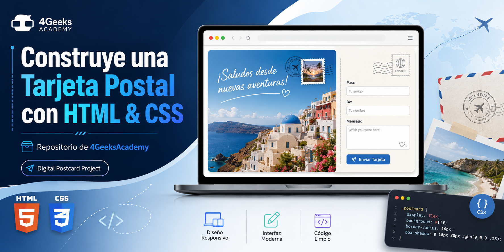

# Digital Postcard

HTML and CSS exercise for 4Geeks Academy. The project builds a centered digital
postcard with a linked stylesheet, a Google Font, box layout, overflow handling,
and a simple form.

Open `index.html` in the browser to preview it. The exercise files are also
available in `src/index.html` and `src/style.css`.
